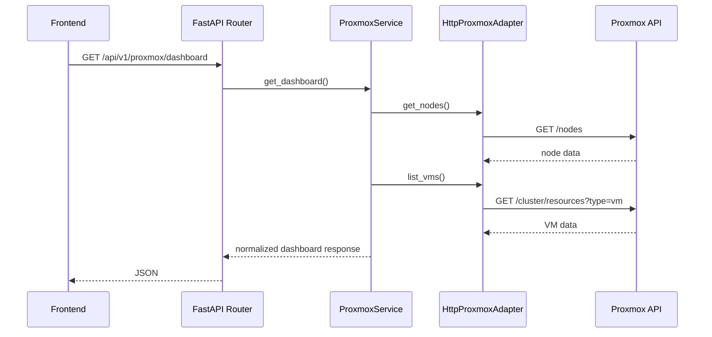

# Backend Architecture

## Overview

The backend is a FastAPI application organized as a modular monolith. Business domains live under `backend/app/modules`, while shared platform concerns live under `backend/app/core`, `backend/app/db`, `backend/app/common`, and `backend/app/adapters`.

## FastAPI Application

Application construction happens in `backend/app/main.py`.

Responsibilities:

- configure structured logging
- create the FastAPI app
- configure CORS
- register the versioned API router
- expose OpenAPI under the configured API prefix

The API prefix is controlled by `settings.api_v1_prefix`, currently defaulting to `/api/v1`.

## API Routing

The main versioned router is `backend/app/api/v1/router.py`.

Current routing pattern:

- `health` is imported from `backend/app/api/v1/routes/health.py`
- domain routers are imported from module folders
- module routers are the canonical source of domain API behavior

Current implemented domain routes include:

- `/api/v1/servers` for inventory
- `/api/v1/proxmox` for Proxmox visibility and controlled lifecycle actions
- `/api/v1/jobs` for SSH command execution, job history, and operational actions

Placeholder routers exist for future modules such as provisioning, deployments, packages, monitoring, profiles, and execution, but they do not yet implement real workflows.

## Module Organization

Backend modules follow a consistent shape:

```text
backend/app/modules/<domain>/
  models.py
  schemas.py
  repository.py
  service.py
  router.py
  tasks.py
```

Not every file is fully implemented yet. Inventory and Jobs are implemented database-backed modules. Proxmox is implemented as an external infrastructure integration module.

## Repository-Service Pattern

Inventory follows the primary repository-service architecture:

- `router.py` handles HTTP concerns and maps domain exceptions to HTTP responses.
- `service.py` owns workflow orchestration and business rules.
- `repository.py` owns persistence queries.
- `schemas.py` defines Pydantic request/response contracts.
- `models.py` defines SQLAlchemy persistence models.

This keeps HTTP logic, business logic, and database access separate.

Jobs follow the same architecture:

- `router.py` exposes command execution, action execution, job lookup, and history endpoints.
- `service.py` validates inventory targets, creates jobs, transitions status, invokes SSH, and persists results.
- `repository.py` owns job persistence queries.
- `actions.py` defines the predefined operational action registry.
- `schemas.py` defines command, action, and job response contracts.

Operational actions do not duplicate execution logic. They resolve an action into a command and call the same Jobs execution flow used by raw commands.

## Async SQLAlchemy

Database access uses SQLAlchemy asyncio.

Key files:

- `backend/app/db/base.py`
- `backend/app/db/session.py`

`session.py` creates an async engine from `settings.database_url` and exposes `get_db_session()` as a FastAPI dependency. Repositories receive an `AsyncSession` and execute SQLAlchemy statements asynchronously.

Inventory commits are currently performed in the service layer after repository operations. This keeps transaction control close to workflow orchestration.

## Migrations

Alembic is configured at the repository root through `alembic.ini` and migration code under `backend/migrations`.

Current migrations create the `servers` and `jobs` tables, plus inventory SSH authentication metadata.

Important migration characteristics:

- imports model metadata in `backend/migrations/env.py`
- uses async migration execution
- targets `Base.metadata`
- supports PostgreSQL enum types for server environment, SSH auth method, server status, and job status

## Configuration

Configuration is defined in `backend/app/core/config.py` using Pydantic Settings.

Configuration sources:

- environment variables
- `.env` file when present
- defaults in the settings class

Important settings include:

- `API_V1_PREFIX`
- `CORS_ORIGINS`
- `DATABASE_URL`
- `PROXMOX_API_URL`
- `PROXMOX_TOKEN_ID`
- `PROXMOX_TOKEN_SECRET`
- `PROXMOX_VERIFY_SSL`
- `PROXMOX_TIMEOUT_SECONDS`
- `SSH_CONNECT_TIMEOUT_SECONDS`
- `SSH_COMMAND_TIMEOUT_SECONDS`
- `SSH_PRIVATE_KEY_PATH`

Proxmox secrets are not committed. They should be supplied by local environment variables or an ignored `.env`.

SSH passwords and private key paths are part of the current local MVP and are not encrypted yet. They should be treated as temporary development/lab metadata until a vault or encryption layer is added.

## Structured Logging

Logging is configured in `backend/app/core/logging.py` with `structlog`.

The inventory service, Proxmox adapter, Jobs service, and SSH adapter use structured log events for successful operations and failure paths.

## Proxmox Backend Flow



## Jobs and Actions Backend Flow

```text
Frontend Jobs page
  -> FastAPI /api/v1/jobs/actions/execute or /api/v1/jobs/execute
  -> JobService
  -> ServerRepository resolves inventory target
  -> JobRepository creates pending/running job
  -> ParamikoSshAdapter executes command
  -> JobRepository persists stdout/stderr/exit_code/status
```

Operational actions are intentionally lightweight. They are predefined action definitions that map to shell commands/scripts and then reuse the Jobs pipeline.

## Current Backend Boundaries

The backend mutates NexusOps-owned inventory/job data, requests controlled Proxmox VM lifecycle actions, and executes SSH commands against inventory-managed hosts. Proxmox VM objects are not direct execution targets.
