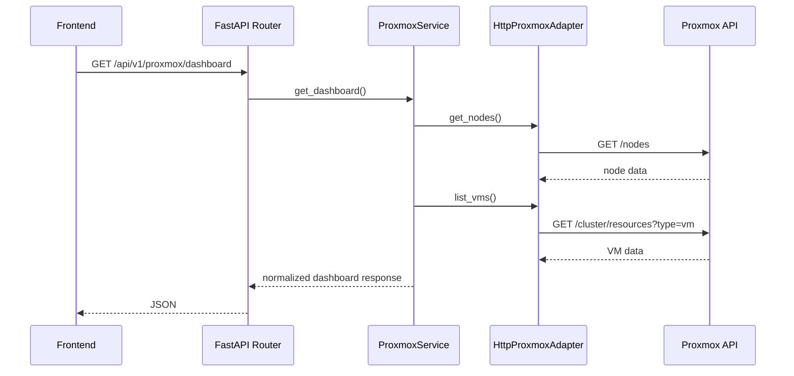

# Backend Architecture

## Overview

The backend is a FastAPI application organized as a modular monolith. Business domains live under `backend/app/modules`, while shared platform concerns live under `backend/app/core`, `backend/app/db`, `backend/app/common`, and `backend/app/adapters`.

## FastAPI Application

Application construction happens in `backend/app/main.py`.

Responsibilities:

- configure structured logging
- create the FastAPI app
- configure CORS
- register the versioned API router
- expose OpenAPI under the configured API prefix

The API prefix is controlled by `settings.api_v1_prefix`, currently defaulting to `/api/v1`.

## API Routing

The main versioned router is `backend/app/api/v1/router.py`.

Current routing pattern:

- `health` is imported from `backend/app/api/v1/routes/health.py`
- domain routers are imported from module folders
- module routers are the canonical source of domain API behavior

Current implemented domain routes include:

- `/api/v1/auth` for local login, JWT refresh, logout hooks, current-user lookup, and admin-only user management
- `/api/v1/servers` for CMDB inventory, lifecycle operations, Proxmox import, and reconciliation
- `/api/v1/proxmox` for Proxmox visibility and controlled lifecycle actions
- `/api/v1/vms` for template-based Proxmox provisioning
- `/api/v1/vms/blueprints` for NexusOps-side provisioning presets
- `/api/v1/jobs` for SSH command execution, job history, and operational actions
- `/api/v1/packages` for reusable package definitions
- `/api/v1/profiles` for reusable infrastructure profile templates and execution
- `/api/v1/credentials` for encrypted reusable credentials and shared accounts
- `/api/v1/variables` for variable-manager foundations
- `/api/v1/integrations` for persisted provider and monitoring integration records
- `/api/v1/workflows` for persistent workflow runs, steps, logs, and execution timelines
- `/api/v1/automations` for scheduled action/package/profile automations
- `/api/v1/identity` for Linux user, group, SSH key, sudo, permission, and replication workflows
- `/api/v1/remote-access` for role-aware browser shell and SFTP file access to Inventory-managed hosts

Placeholder or foundation modules still exist for future expansion, but deployments, monitoring, integrations, and execution now have varying levels of implemented API surface.

## Module Organization

Backend modules follow a consistent shape:

```text
backend/app/modules/<domain>/
  models.py
  schemas.py
  repository.py
  service.py
  router.py
  tasks.py
```

Not every file is fully implemented yet. Inventory and Jobs are implemented database-backed modules. Proxmox is implemented as an external infrastructure integration module.

Authentication is implemented as a platform module under `backend/app/modules/auth/` with separate API, model, repository, schema, service, and security folders. Local platform users are stored in the `users` table with `admin`, `operator`, or `viewer` roles. Passwords are hashed with passlib/bcrypt and are never returned by API schemas.

Authentication and authorization are separate internally:

- authentication resolves the current platform user from a JWT access token
- authorization is expressed through reusable dependencies: `get_current_user()`, `require_admin()`, `require_operator()`, and `require_viewer()`

Access tokens are short lived, refresh tokens are longer lived, and both include `sub`, `username`, `role`, and `exp` claims. Startup can bootstrap a local admin from `NEXUSOPS_ADMIN_USER`, `NEXUSOPS_ADMIN_EMAIL`, and `NEXUSOPS_ADMIN_PASSWORD`; admin users are not hardcoded in migrations.

Admin-only user lifecycle endpoints live under `/api/v1/auth/users`. They support listing users, creating users, editing role/status/superuser flags, and resetting passwords. Backend route dependencies enforce admin access regardless of frontend visibility.

Platform identity remains distinct from Linux infrastructure identity. The auth module controls who can log into NexusOps. The Identity module continues to orchestrate Linux users, groups, SSH keys, sudo snippets, and filesystem permissions on managed hosts.

## Repository-Service Pattern

Inventory follows the primary repository-service architecture and acts as the orchestration source of truth:

- `router.py` handles HTTP concerns and maps domain exceptions to HTTP responses.
- `service.py` owns workflow orchestration, lifecycle state, Proxmox import, and reconciliation rules.
- `repository.py` owns persistence queries.
- `schemas.py` defines Pydantic request/response contracts.
- `models.py` defines SQLAlchemy persistence models.

Inventory records carry provider linkage and CMDB state:

- `provider`, `external_id`, and legacy `vmid`
- `source`, `managed`, and `lifecycle_state`
- `sync_status`, `provider_node`, `provider_type`, provider metadata, and `last_seen_at`

Deleting or archiving an inventory record never destroys the provider VM. Delete operations now run reference cleanup in `InventoryService` before removing active inventory records: provisioning request links, virtual machine links, workflow target links, and deployment target rows are cleared where applicable. If historical constraints prevent hard deletion, the record is archived.

This keeps HTTP logic, business logic, and database access separate.

Jobs follow the same architecture:

- `router.py` exposes command execution, action execution, job lookup, and history endpoints.
- `service.py` validates inventory targets, creates jobs, transitions status, invokes SSH, and persists results.
- `repository.py` owns job persistence queries.
- `actions.py` defines the predefined operational action registry.
- `schemas.py` defines command, action, and job response contracts.

Operational actions do not duplicate execution logic. They resolve an action into a command and call the same Jobs execution flow used by raw commands. Jobs can resolve SSH authentication from legacy inline inventory metadata, a node-level `credential_id`, or an explicit execution `credential_ref`. When package/profile execution injects sensitive runtime values, Jobs persist the redacted command instead of the in-memory command sent to SSH.

Packages and Profiles are lightweight orchestration definitions:

- Packages expose reusable package metadata, install commands, uninstall commands, validation commands, variables, and tags.
- Custom package definitions are persisted and can be created, edited, deleted, cloned, and executed.
- Built-in package definitions can be edited through persisted overrides while preserving reset-to-default capability.
- Profiles compose ordered action/package/command steps.
- Custom profiles are persisted and can be created, edited, deleted, cloned, and applied.
- Built-in profiles can be edited through persisted overrides while preserving reset-to-default capability.
- Applying a profile resolves each step into a command and calls `JobService.execute()` sequentially.
- Sensitive package/profile variables are supplied as `credential_refs`, resolved through the Credential Manager at runtime, and redacted from persisted job command history.

Template metadata fields track override and clone state:

- `is_builtin`
- `is_modified`
- `base_version`
- `source_template_id`
- `modified_at`

Variable resolution lives in `backend/app/common/variables.py`. It supports only simple `{{ variable_name }}` placeholder substitution from defaults, execution-time variables, and backend-resolved credential values. It intentionally does not implement Jinja, arbitrary Python, or a workflow engine.

Credential Manager is implemented as a separate module:

- `models.py` defines `Credential` and `CredentialUsage`
- `schemas.py` exposes create/update/read contracts that never return decrypted values
- `encryption_service.py` encrypts and decrypts values with Fernet
- `service.py` owns duplicate-name protection, encryption, masking, and runtime resolution
- `router.py` exposes CRUD under `/api/v1/credentials`

Credential records are encrypted using `NEXUSOPS_MASTER_KEY`. API responses expose `masked_secret` only. Decrypted values are used only inside backend runtime execution paths.

Remote Access is implemented under `backend/app/modules/remote_access/` as a backend-mediated SSH/SFTP module. It accepts only Inventory `server_id` targets, rejects unmanaged or archived records, resolves SSH metadata and Credential Manager records server-side, and never returns SSH passwords or private key material to the frontend. Its WebSocket shell uses Paramiko interactive channels. Its file endpoints use SFTP listing, reading, hash-checked writing, and temporary-file rename where practical.

Remote access RBAC is intentionally coarse for this sprint:

- admins can use shell, browse/read files, and edit files anywhere the SSH account allows
- operators can use shell and browse/read files, but can edit only under `/opt`, `/srv`, `/var/www`, and `/home`
- viewers have no remote-access capability by default

Shell transcripts and file contents are not persisted. Structured audit hooks record shell session open/close/failure and file list/read/write outcomes without logging command input or file content. The shell WebSocket currently accepts the JWT access token as a query parameter for MVP browser compatibility; this should later become a short-lived remote-access session token scoped to host and operation.

Variable Manager foundations are implemented under `backend/app/modules/variables/`. Secret variables must reference credentials instead of storing plaintext values.

Integrations are persisted separately from runtime adapter configuration. Proxmox runtime adapters now resolve from enabled persisted Proxmox integrations first and fall back to local environment settings when no enabled integration exists.

Integration schemas validate known structured config fields such as URL, SSL verification, and timeout while preserving the existing JSON `config` storage model. Secrets should be referenced through Credential Manager IDs in `credential_refs`.

Workflow runs are the persistent orchestration timeline foundation:

- `workflow_runs` stores the workflow type, trigger source, target host, status, timestamps, context, result summary, and errors.
- `workflow_steps` stores ordered step status, logs, errors, metadata, and timestamps.
- Workflow APIs expose list/detail polling for frontend visibility.

Scheduled automations are backed by APScheduler and an in-process async task queue for the MVP. Automations currently support predefined actions, package execution, and profile execution. Automation runs create WorkflowRuns and then execute through existing service pipelines:

```text
Automation -> WorkflowRun -> Job/Profile/Package Service -> Jobs -> SSH Adapter -> persistence
```

Celery/Redis are intentionally not introduced in this sprint.

## Async SQLAlchemy

Database access uses SQLAlchemy asyncio.

Key files:

- `backend/app/db/base.py`
- `backend/app/db/session.py`

`session.py` creates an async engine from `settings.database_url` and exposes `get_db_session()` as a FastAPI dependency. Repositories receive an `AsyncSession` and execute SQLAlchemy statements asynchronously.

Inventory commits are currently performed in the service layer after repository operations. This keeps transaction control close to workflow orchestration.

## Migrations

Alembic is configured at the repository root through `alembic.ini` and migration code under `backend/migrations`.

Current migrations create the `servers` and `jobs` tables, inventory SSH authentication metadata, definition tables, provisioning requests, provisioning blueprints, inventory synchronization metadata, integration records, template override/variable metadata, encrypted credentials, credential usages, variables, inventory credential references, deployment credential references, integration credential references, and provisioning additional disk metadata.

Important migration characteristics:

- imports model metadata in `backend/migrations/env.py`
- uses async migration execution
- targets `Base.metadata`
- supports PostgreSQL enum types for server environment, SSH auth method, server status, and job status

## Configuration

Configuration is defined in `backend/app/core/config.py` using Pydantic Settings.

Configuration sources:

- environment variables
- `.env` file when present
- defaults in the settings class

Important settings include:

- `API_V1_PREFIX`
- `CORS_ORIGINS`
- `DATABASE_URL`
- `PROXMOX_API_URL`
- `PROXMOX_TOKEN_ID`
- `PROXMOX_TOKEN_SECRET`
- `PROXMOX_VERIFY_SSL`
- `PROXMOX_TIMEOUT_SECONDS`
- `SSH_CONNECT_TIMEOUT_SECONDS`
- `SSH_COMMAND_TIMEOUT_SECONDS`
- `SSH_PRIVATE_KEY_PATH`
- `NEXUSOPS_MASTER_KEY`
- `NEXUSOPS_ADMIN_USER`
- `NEXUSOPS_ADMIN_EMAIL`
- `NEXUSOPS_ADMIN_PASSWORD`
- `ACCESS_TOKEN_EXPIRE_MINUTES`
- `REFRESH_TOKEN_EXPIRE_DAYS`
- `JWT_ALGORITHM`

Proxmox secrets are not committed. They should be supplied by local environment variables or an ignored `.env`.

Legacy inline SSH passwords and private key paths remain for backward compatibility and local MVP metadata. Shared credentials should use the Credential Manager so reusable secrets are encrypted and resolved server-side.

## Structured Logging

Logging is configured in `backend/app/core/logging.py` with `structlog`.

The inventory service, Proxmox adapter, Jobs service, and SSH adapter use structured log events for successful operations and failure paths.

## Proxmox Backend Flow



## Inventory Synchronization Flow

```text
Frontend Infrastructure page
  -> GET /api/v1/proxmox/dashboard
  -> ProxmoxService normalizes discovered VMs
  -> ServerRepository matches provider/external ID, hostname, and IP when available
  -> VM response includes synced, unmanaged, mismatch, orphaned, or archived status

Operator import
  -> POST /api/v1/servers/sync/proxmox/import
  -> InventoryService creates a managed inventory record
  -> provider=proxmox, external_id=vmid, source=imported, lifecycle_state=managed

Reconciliation
  -> POST /api/v1/servers/sync/proxmox/reconcile
  -> InventoryService updates linked records with provider metadata and sync status
```

## Jobs and Actions Backend Flow

```text
Frontend Jobs page
  -> FastAPI /api/v1/jobs/actions/execute or /api/v1/jobs/execute
  -> JobService
  -> ServerRepository resolves inventory target
  -> CredentialService resolves node credential_id or execution credential_ref when present
  -> JobRepository creates pending/running job
  -> ParamikoSshAdapter executes command
  -> JobRepository persists stdout/stderr/exit_code/status
```

Operational actions are intentionally lightweight. They are predefined action definitions that map to shell commands/scripts and then reuse the Jobs pipeline.

## Remote Access Backend Flow

```text
Frontend Host Tools page
  -> /api/v1/remote-access/hosts/{server_id}/shell or /files
  -> RemoteAccessService
  -> ServerRepository resolves Inventory target
  -> reject unmanaged/archived targets
  -> enforce admin/operator/viewer remote-access rules
  -> CredentialService resolves SSH credentials server-side
  -> Paramiko shell channel or SFTP operation
  -> structured audit hook
```

Remote Access is for interactive operations and controlled file browsing/editing. It does not replace Jobs for persisted command execution, package/profile automation, identity replication, deployments, or scheduled workflows.

## Profiles Backend Flow

```text
Frontend Profiles page
  -> FastAPI /api/v1/profiles/{profile_id}/apply
  -> ProfileService
  -> resolve action/package/command step
  -> resolve simple template variables and sensitive credential_refs
  -> JobService.execute()
  -> SSH adapter
  -> persisted job result with redacted command when secrets were injected
```

Package/profile definition CRUD uses module repositories and persists only definitions and template override metadata. Actual execution history remains centralized in Jobs. Resetting a built-in template removes the persisted override and leaves job history untouched.

## Package Execution Flow

```text
Frontend Packages page
  -> FastAPI /api/v1/packages/{package_id}/execute
  -> PackageAutomationService
  -> load built-in/default/override/custom package definition
  -> resolve `{{ variable_name }}` placeholders and sensitive credential_refs
  -> JobService.execute()
  -> SSH adapter
  -> persisted job result with redacted command when secrets were injected
```

## Identity Backend Flow

```text
Frontend Identity page
  -> FastAPI /api/v1/identity
  -> Linux identity services
  -> IdentityReplicationService
  -> JobService.execute_bulk()
  -> SSH adapter
  -> managed Linux hosts
```

Identity is operational Linux infrastructure orchestration. It stores reusable Linux users, groups, public SSH keys, and permission templates, then applies them to selected Inventory-managed hosts. It does not implement LDAP, Kerberos, FreeIPA, Active Directory, SSSD, PAM rewriting, or login federation.

Identity also exposes a guided preset layer:

- access profiles for common roles such as Administrator, Deployment Operator, Docker Operator, Log Viewer, Read Only, and Service Account
- operational group presets for `docker`, administrator access, `adm`, `systemd-journal`, `www-data`, and `libvirt`
- permission presets for common chmod modes
- group discovery through `getent group` fanout

Administrator access is resolved during execution with a distro-aware shell expression, choosing `sudo` for Debian/Ubuntu-style hosts and `wheel` for RHEL/CentOS/Fedora-style hosts. This keeps the UI focused on "Administrator Access" while preserving Linux-specific execution behavior.

## Provisioning Backend Flow

```text
Frontend Provisioning page
  -> FastAPI /api/v1/vms
  -> ProvisioningService
  -> ProxmoxAdapter clone/configure/start/template task polling
  -> SSH readiness polling
  -> InventoryService creates managed server
  -> optional ProfileService / PackageAutomationService bootstrap
  -> Jobs persist bootstrap execution
```

Provisioning uses Proxmox templates only. Cloud-init configuration sets identity, SSH credentials, static IP/CIDR, gateway, DNS, CPU, memory, network bridge, on-boot behavior, and description metadata.

Provisioned records are created as managed Inventory assets with `provider=proxmox`, `external_id=<vmid>`, `source=provisioned`, `lifecycle_state=provisioned`, and `sync_status=synced`.

Provisioning can also apply NexusOps provisioning blueprints. Blueprints are database-backed presets around a provider-side Proxmox template. They store fixed defaults such as target node, Proxmox template ID, CPU, memory, root disk, additional disks, bridge, gateway, DNS, default username, tags, environment, and bootstrap profile/package IDs. They intentionally leave VM name, VMID, cloud-init hostname, and static IP/CIDR as per-run inputs.

Provisioning supports one root disk resized as `scsi0` plus optional additional disks created after clone/configuration. Extra disk storage names are currently operator-entered and should later be sourced from Proxmox storage discovery.

## Deployment Backend Flow

```text
Frontend Deployments page
  -> FastAPI /api/v1/deployments
  -> DockerComposeDeploymentService
  -> resolve deployment credential_refs into .env content
  -> JobService.execute()
  -> SSH adapter
  -> docker compose on inventory-managed host
```

Docker Compose deployments persist compose content, optional plaintext env content for non-secret values, credential-backed env references for secrets, deployment target metadata, and deployment revisions. Deploy/redeploy/restart/stop/status/logs reuse Jobs and never create a parallel remote-execution path.

Deployment command history is redacted when credential-backed env values are injected.

Deployment create requests accept both the existing `target_server_id` and a `target_server_ids` list. The service currently validates the list and uses the first target for the existing single-target execution path; distributed deployment fanout is intentionally deferred.

## Current Backend Boundaries

The backend mutates NexusOps-owned inventory/job data, requests controlled Proxmox VM lifecycle actions, and executes SSH commands against inventory-managed hosts. Proxmox VM objects are not direct execution targets.
