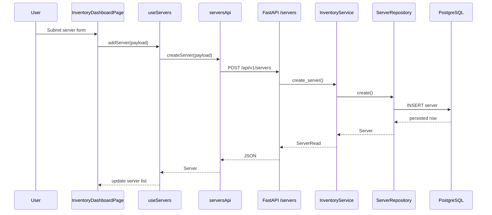

# Sprint 1: Inventory

## Goal

Implement the first complete NexusOps frontend-to-backend workflow using server inventory. This sprint validated the platform architecture with a real database-backed feature.

## Backend Implementation

Inventory was implemented under:

```text
backend/app/modules/inventory/
```

Implemented files:

- `models.py`
- `schemas.py`
- `repository.py`
- `service.py`
- `router.py`

The backend supports:

- create server
- list servers
- get server
- update server
- delete server
- filter by environment
- filter by provider
- search by hostname or IP address

## Data Model

The `Server` model stores:

- hostname
- IP address
- operating system
- VM/provider metadata
- environment
- tags
- SSH port
- SSH username
- status
- timestamps

Hostname and IP address are unique.

## API Endpoints

Inventory endpoints are registered under:

```text
/api/v1/servers
```

Implemented endpoints:

- `GET /api/v1/servers`
- `GET /api/v1/servers/{server_id}`
- `POST /api/v1/servers`
- `PUT /api/v1/servers/{server_id}`
- `DELETE /api/v1/servers/{server_id}`

## Frontend Implementation

Inventory frontend code lives under:

```text
frontend/src/features/inventory/
```

Implemented structure:

- `api/serversApi.ts`
- `components/CreateServerForm.tsx`
- `components/ServerBadges.tsx`
- `components/ServerList.tsx`
- `hooks/useServers.ts`
- `pages/InventoryDashboardPage.tsx`
- `types/server.ts`
- `utils/options.ts`

## User Interface

The inventory dashboard includes:

- summary metric cards
- create server form
- required-field validation
- SSH port validation
- loading skeletons
- API error display
- retry action
- responsive server table/cards

## Integration Flow



## Validation

Validation covered:

- frontend build
- TypeScript compilation
- frontend lint
- backend tests
- live inventory CRUD against PostgreSQL
- validation errors
- CORS preflight
- Alembic migration upgrade/downgrade

## Architecture Decisions

- Keep inventory as the first complete workflow because it exercises the full architecture.
- Commit transactions in the service layer.
- Keep repository methods persistence-focused.
- Keep frontend API types feature-local.
- Normalize API errors in the shared frontend API client.

## Status

Sprint 1 is complete. Inventory is the current stable CRUD foundation for future synchronization with Proxmox-discovered infrastructure.
